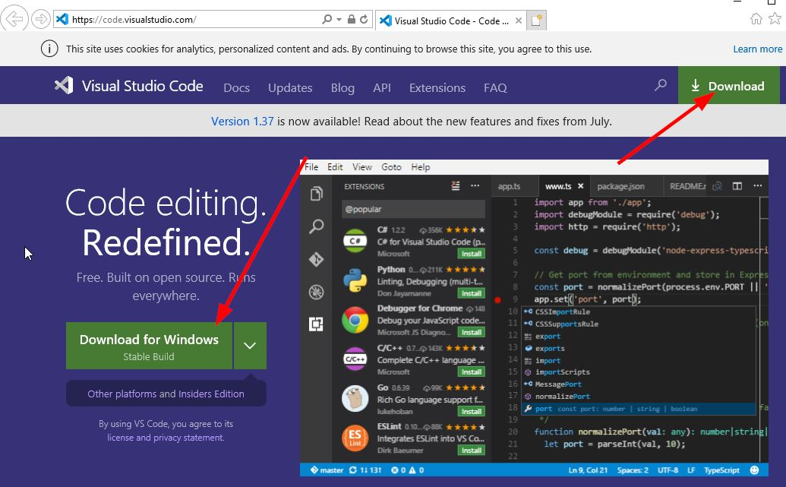

# Python Programing

## Start Python command line

```python
c:\> py
```

## VSCode for Python

The VS Code extension for Python: Python for VSCode.

## Write to a file named "guru99.txt"
```python
f = open("guru99.txt","w+")
for i in range(10):
     f.write("This is line %d\r\n" % (i+1))

f.close()
```

## Execute Python file

```python
c:\> py add.py
c:\> py game.py
right-click mouse, select "Run Python file in terminal."
```

## import Python module, and use the module

```python
>>> import add
>>> import fib
>>> fib.fib(1000)
```

## Download Visual Code

[Download Visual Code](https://code.visualstudio.com/)


[Start up Visual Code](https://code.visualstudio.com/docs?start=true)

## Create a virtual environment

```bash
PS C:\Users\V801625\workspace\python> py -m venv venv
```
where -m means create a module, first venv is virtual environment, second is the name of the newly created virtual environment.

PS C:\Users\V801625\workspace\python> & c:/Users/V801625/workspace/python/venv/Scripts/activate.ps1
(venv) PS C:\Users\V801625\workspace\python>

where (venv) means the virtual environment is up and running.

## Install pip requests

```bash
(venv) PS C:\Users\V801625\workspace\python> pip install requests
 python -m pip install --upgrade pip
```